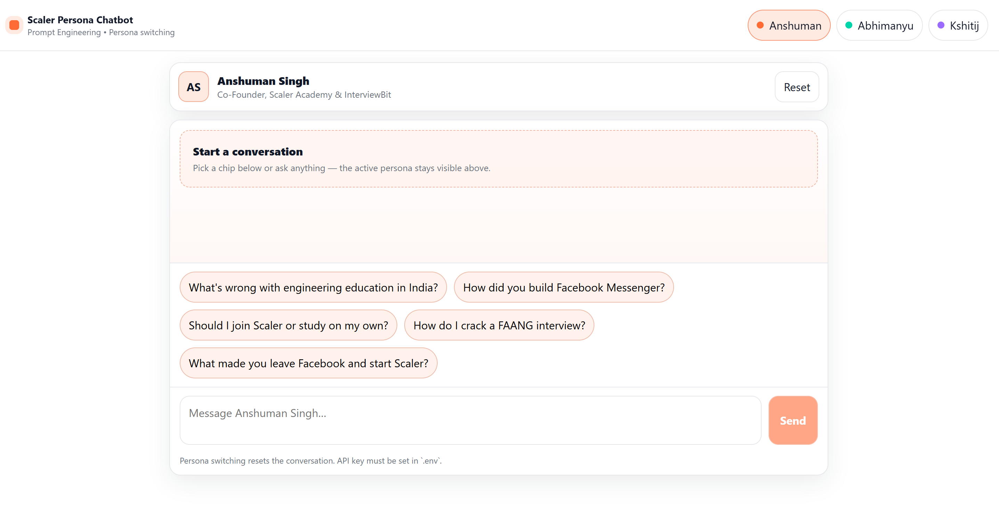
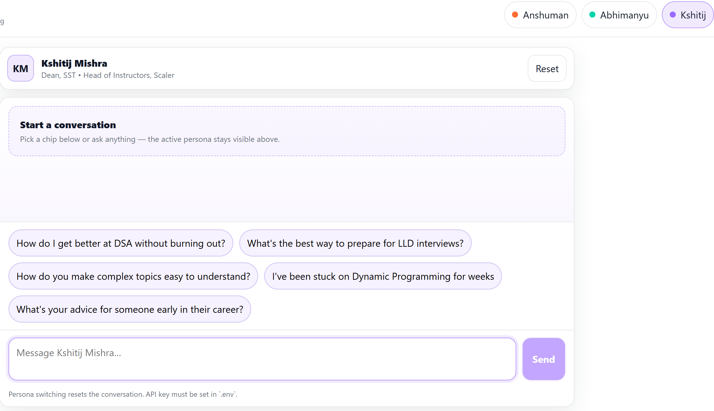
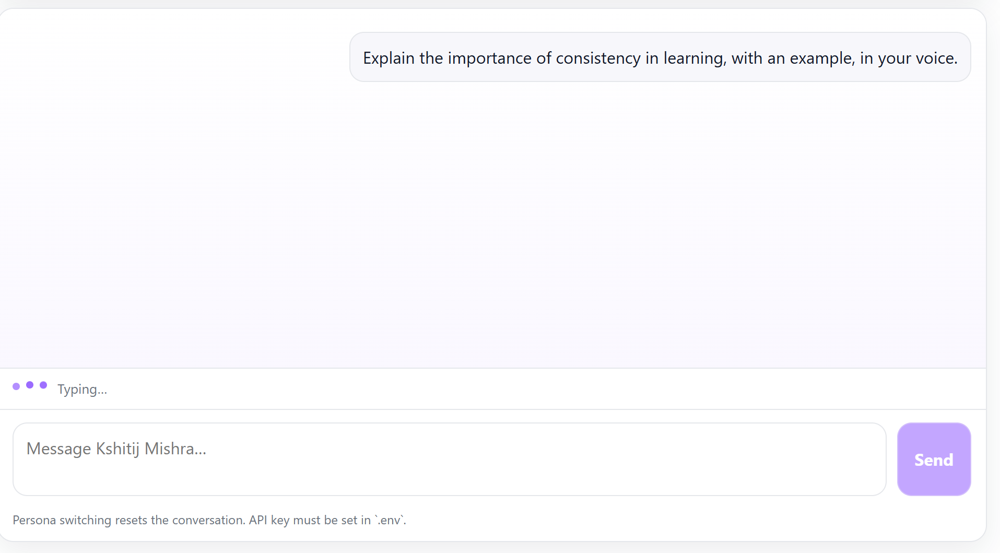
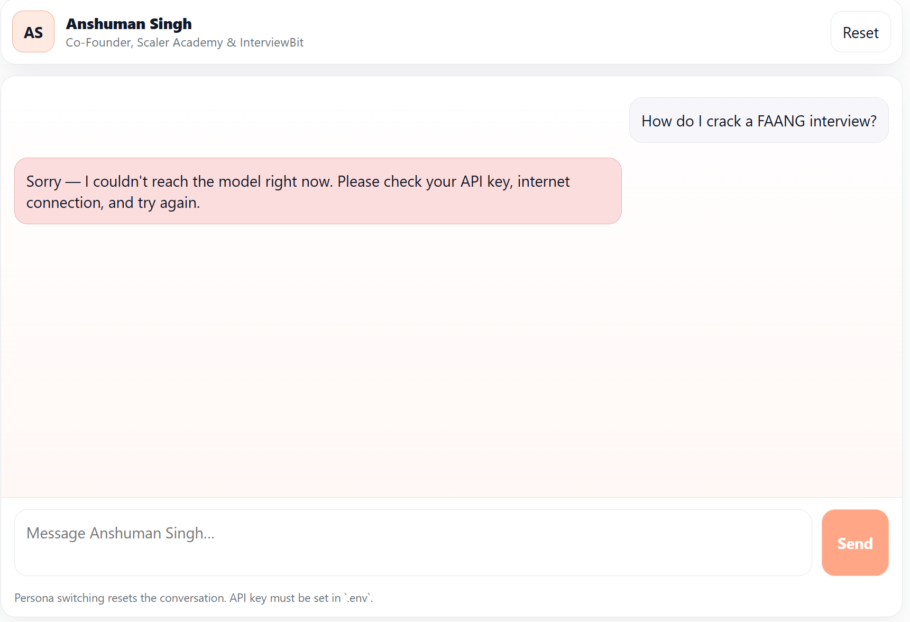

# Scaler Persona Chatbot — Assignment 01

Persona-based AI chatbot with three personalities:
- Anshuman Singh
- Abhimanyu Saxena
- Kshitij Mishra

## Live Demo

- Deployed URL: https://genai-assigment-uytr.vercel.app/

## Tech Stack

- React + Vite (frontend)
- Groq Chat Completions API (OpenAI-compatible)

## Features Checklist

- Persona switcher (3 personas)
- Switching persona resets conversation + swaps system prompt
- Active persona always visible
- Persona-specific suggestion chips (only before first message)
- Typing indicator while model is generating
- Mobile responsive
- Graceful API error handling (shows message in chat)

## Setup (Local)

1) Install dependencies

```bash
npm install
```

2) Create `.env` (do not commit it)

```bash
copy .env.example .env
```

Then edit `.env` and set:

```bash
VITE_GROQ_API_KEY=...
```

3) Run dev server

```bash
npm run dev
```

## Deployment

This is a static Vite app. Deploy on Vercel/Netlify and set the environment variable:

- `VITE_GROQ_API_KEY`

Then redeploy.

## Submission Docs

- See `prompts.md` for all 3 annotated system prompts
- See `reflection.md` for the 300–500 word reflection

## Screenshots





Add screenshots here before submitting (recommended: put images in `public/screenshots/` and link them below):
- Persona switcher + header
- Chat with chips
- Typing indicator
- Error state
